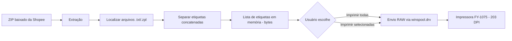

# Plano de Desenvolvimento — Shopee Label Printer

> Documento de referência para continuar este projeto no Claude Code.
> Cole este arquivo na raiz do repositório (ex: `PLANO_DESENVOLVIMENTO.md`)
> e peça ao Claude Code para seguir as fases abaixo uma de cada vez.

---

## 1. Visão do projeto

Um programa desktop para Windows que resolve **um problema específico**:
imprimir etiquetas de envio da Shopee (baixadas em ZIP) direto numa
impressora térmica de etiquetas (modelo de referência: **FY-1075, 203 DPI**)
**sem nenhuma perda de resolução** — sem conversão para PDF, sem
reamostragem de imagem, sem intermediários que degradem texto, endereço ou
código de barras.

O programa já existe numa primeira versão funcional (Python + tkinter,
zero dependências externas). Este documento organiza os próximos passos
para evoluir isso de um script pessoal para um projeto open source
profissional, com build automatizado e um site de documentação.

---

## 2. Escopo

### 2.1 Escopo confirmado (o que este projeto FAZ)

- Importar um arquivo **`.zip` baixado do painel da Shopee** contendo
  etiquetas de envio em formato ZPL/TSPL (arquivos `.txt`).
- Extrair e identificar cada etiqueta individual dentro do ZIP (inclusive
  quando várias etiquetas vêm concatenadas no mesmo arquivo).
- Enviar cada etiqueta **em modo bruto (RAW)** para uma impressora térmica
  compatível com comandos TSPL/ZPL/ESC-POS (referência: FY-1075, 203 DPI),
  preservando os bytes originais 1:1 — ou seja, na resolução máxima que a
  impressora suporta, sem qualquer perda.
- Rodar localmente no Windows do usuário, sem enviar dados a servidores
  externos (a etiqueta contém endereço e dados pessoais do
  destinatário — isso deve continuar 100% local).

### 2.2 Fora de escopo (non-goals — importante manter isso explícito)

Estes itens **não** entram neste projeto, para manter o foco e evitar que
ele vire um software genérico de etiquetas:

- ❌ Suporte a outros marketplaces (Mercado Livre, Amazon, etc.) — mesmo
  que o parser ZPL funcionasse tecnicamente, o produto é para Shopee.
- ❌ Conversão para PDF como funcionalidade do produto (isso foi só um
  paliativo enquanto não existia o envio direto — não deve voltar).
- ❌ Edição/design de etiquetas.
- ❌ Suporte oficial a outras marcas de impressora além de modelos
  compatíveis com TSPL/ZPL genérico de 203 DPI (não há necessidade de
  suportar impressoras a laser, jato de tinta, ou térmicas de recibo).
- ❌ Versão mobile ou web hospedada (o app roda local no Windows do
  vendedor — ver seção 10 sobre por que o GitHub Pages serve só para
  documentação, não para rodar o app).

Se alguma dessas ideias surgir durante o desenvolvimento, registre no
**Backlog futuro** (seção 11) em vez de implementar — mantém o escopo
limpo.

---

## 3. Estado atual (ponto de partida)

- [x] Script único `shopee_print_app.py`, interface gráfica em `tkinter`.
- [x] Importação de `.zip`, pasta ou arquivo `.txt` avulso.
- [x] Separação automática de múltiplas etiquetas dentro de um mesmo
      arquivo (detecção por blocos `~DG` ou `^XA`).
- [x] Envio RAW via `ctypes` + `winspool.drv` no Windows (zero
      dependências — nada de `pip install` necessário para rodar).
- [x] Fallback para `lp -o raw` em macOS/Linux (não é o alvo principal,
      mas não quebra o script fora do Windows).
- [x] Validado localmente: extração de ZIP e fidelidade de bytes
      (byte a byte idêntico ao arquivo original da Shopee).
- [ ] **Ainda não testado numa impressora FY-1075 real** — esse é o
      primeiro item da Fase 1.

---

## 4. Arquitetura

### 4.1 Stack

| Camada | Escolha | Motivo |
|---|---|---|
| Linguagem | Python 3.10+ | Já disponível, rápido de iterar |
| Interface | `tkinter` (stdlib) | Zero dependência extra |
| Impressão RAW | `ctypes` + `winspool.drv` | Evita `pywin32`, reduz fricção de instalação |
| Empacotamento | PyInstaller (`--onefile`) | Gera `.exe` standalone |
| CI/CD | GitHub Actions (`windows-latest`) | Builda o `.exe` de forma reprodutível, sem depender do PC de ninguém |
| Documentação | GitHub Pages (estático) | Grátis, versionado junto com o código |

### 4.2 Fluxo de dados



Princípio central da arquitetura: **os bytes da etiqueta nunca são
decodificados, re-renderizados ou re-comprimidos** entre o ZIP e a
impressora. Qualquer funcionalidade nova (preview, log, etc.) deve ler os
bytes sem alterá-los antes do envio.

---

## 5. Estrutura de repositório proposta

```
shopee-label-printer/
├── src/
│   └── shopee_label_printer/
│       ├── __init__.py
│       ├── app.py              # interface gráfica (tkinter)
│       ├── parser.py           # extração de ZIP + separação de etiquetas
│       ├── printer.py          # envio RAW (winspool / lp)
│       └── __main__.py         # ponto de entrada (python -m shopee_label_printer)
├── tests/
│   ├── fixtures/
│   │   └── exemplo_etiqueta.txt
│   ├── test_parser.py
│   └── test_printer_mock.py    # testa a lógica sem precisar de impressora real
├── .github/
│   └── workflows/
│       ├── build.yml           # gera o .exe a cada tag de versão
│       └── tests.yml           # roda os testes a cada push/PR
├── docs/                       # conteúdo do GitHub Pages
│   ├── index.html
│   ├── download.html
│   └── changelog.html
├── CHANGELOG.md
├── README.md
├── LICENSE
└── PLANO_DESENVOLVIMENTO.md    # este arquivo
```

> Nota para o Claude Code: o script atual está todo num arquivo só
> (`shopee_print_app.py`). A Fase 1 inclui separar isso em módulos
> (`parser.py`, `printer.py`, `app.py`) mantendo o comportamento idêntico
> — é refatoração, não reescrita.

---

## 6. Roadmap por fases

### Fase 0 — Fundação do repositório
- [ ] Criar repositório no GitHub (`shopee-label-printer`, público ou privado).
- [ ] Adicionar `.gitignore` (Python padrão + `dist/`, `build/`, `*.spec`).
- [ ] Adicionar `LICENSE` (sugestão: MIT, simples e permissiva).
- [ ] Mover o código atual para a estrutura de pastas da seção 5.
- [ ] Primeiro commit.

### Fase 1 — Estabilização
- [ ] **Testar em impressora FY-1075 real** e corrigir o que não funcionar
      (prioridade máxima — tudo antes disso é teórico).
- [ ] Separar `shopee_print_app.py` em módulos (`parser.py`, `printer.py`, `app.py`).
- [ ] Adicionar tratamento de erro amigável para: impressora offline,
      ZIP corrompido, arquivo sem etiqueta válida dentro.
- [ ] Adicionar log em arquivo (`%APPDATA%/ShopeeLabelPrinter/log.txt`)
      além do log na tela, para diagnosticar problemas remotamente.
- [ ] Escrever testes automatizados para `parser.py` (extração de ZIP,
      separação de etiquetas) usando `pytest` — isso não depende de
      impressora, pode rodar em qualquer máquina/CI.

### Fase 2 — Empacotamento profissional
- [ ] Criar `.github/workflows/build.yml`: builda o `.exe` automaticamente
      num runner `windows-latest` a cada tag de versão (`v1.0.0`, etc.)
      e sobe o `.exe` como anexo de uma GitHub Release.
      **Isso resolve de vez o problema de compilar manualmente** — o
      PyInstaller roda direto no Windows real do GitHub, sem depender do
      seu PC.
- [ ] Assinar o `.exe`? (opcional — sem assinatura digital, o Windows
      SmartScreen vai avisar "editor desconhecido" no primeiro uso; para
      uso pessoal/pequena equipe isso é aceitável, mas fica registrado
      aqui como possível melhoria futura).

### Fase 3 — Robustez de parsing
- [ ] Coletar 3-5 exemplos reais de ZIPs baixados da Shopee (nomes de
      arquivo, estrutura de pastas dentro do ZIP) para confirmar que o
      parser cobre todos os formatos que a Shopee usa.
- [ ] Adicionar esses exemplos como fixtures de teste (removendo dados
      pessoais reais antes de commitar, claro).
- [ ] Tratar casos-limite: ZIP vazio, ZIP com PDF misturado com TXT,
      nomes de arquivo com acentos/caracteres especiais.

### Fase 4 — Experiência de uso
- [ ] Detecção automática da impressora térmica na lista (pré-selecionar
      se só houver uma, ou se o nome contiver "FY" / termos comuns).
- [ ] Contador de etiquetas impressas no dia/sessão.
- [ ] Opção de reimprimir a última etiqueta enviada (útil pra falha de
      impressão física, papel enroscado, etc.).
- [ ] (Opcional, avaliar depois) Preview visual da etiqueta antes de
      imprimir, decodificando o `~DG` como fizemos manualmente nesta
      conversa — mas isso é só para visualização em tela, nunca deve
      substituir o envio RAW real.

### Fase 5 — Documentação e GitHub Pages
- Ver seção 10 detalhada abaixo.

---

## 7. Plano de testes

| Tipo | Ferramenta | O que cobre | Roda onde |
|---|---|---|---|
| Unitário | `pytest` | `parser.py`: extração de ZIP, separação de etiquetas, fidelidade de bytes | Qualquer máquina / CI |
| Unitário (mock) | `pytest` + mock de `winspool` | `printer.py`: garante que a função monta a chamada certa, sem precisar de impressora física | Qualquer máquina / CI |
| Manual | Checklist manual | Impressão real ponta a ponta na FY-1075 | Só no Windows com a impressora conectada |

Checklist mínimo de teste manual antes de cada release:
1. Importar um ZIP real da Shopee com várias etiquetas.
2. Confirmar que a contagem de etiquetas encontradas bate com o esperado.
3. Imprimir todas e conferir visualmente: endereço legível, código de
   barras/QR escaneável com o celular, sem falhas de traço na fonte.
4. Testar com a impressora desligada (deve dar erro amigável, não travar).
5. Testar reimportar um novo ZIP sem fechar o programa (não deve
   acumular etiquetas antigas na lista).

---

## 8. CI/CD com GitHub Actions

Exemplo de workflow para gerar o `.exe` automaticamente
(`.github/workflows/build.yml`):

```yaml
name: Build executável

on:
  push:
    tags:
      - "v*"

jobs:
  build:
    runs-on: windows-latest
    steps:
      - uses: actions/checkout@v4

      - name: Configurar Python
        uses: actions/setup-python@v5
        with:
          python-version: "3.12"

      - name: Instalar dependências
        run: pip install pyinstaller

      - name: Gerar executável
        run: |
          python -m PyInstaller --onefile --windowed `
            --name "ShopeeLabelPrinter" `
            src/shopee_label_printer/app.py

      - name: Publicar na Release
        uses: softprops/action-gh-release@v2
        with:
          files: dist/ShopeeLabelPrinter.exe
```

Com isso, o fluxo de lançar uma nova versão vira:

```
git tag v1.1.0
git push origin v1.1.0
```

E alguns minutos depois o `.exe` já está anexado numa Release no GitHub,
pronto pra baixar — sem precisar compilar manualmente nunca mais.

Workflow adicional recomendado (`.github/workflows/tests.yml`): roda
`pytest` a cada push/PR, pra pegar regressões antes de gerar release.

---

## 9. Versionamento e Releases

- Adotar [Versionamento Semântico](https://semver.org/lang/pt-BR/):
  `MAJOR.MINOR.PATCH` (ex: `1.2.0`).
  - `PATCH`: correções de bug (ex: um formato de ZIP que não era lido).
  - `MINOR`: funcionalidade nova sem quebrar a anterior (ex: reimprimir
    última etiqueta).
  - `MAJOR`: mudança que quebra compatibilidade (raramente deve acontecer
    aqui, dado o escopo restrito).
- Manter um `CHANGELOG.md` simples, atualizado a cada release, no formato
  [Keep a Changelog](https://keepachangelog.com/pt-BR/).

---

## 10. Plano de hospedagem no GitHub Pages

### 10.1 O que o GitHub Pages pode e não pode fazer aqui

O GitHub Pages hospeda **apenas conteúdo estático** (HTML/CSS/JS). Ele
**não roda o programa Python** e **não substitui o `.exe`** — o app
continua sendo baixado e executado localmente no Windows do usuário.

O papel do GitHub Pages neste projeto é ser a **vitrine e central de
documentação**: uma página onde qualquer pessoa (inclusive você, daqui a
6 meses) encontra rapidamente o que o projeto faz, como instalar, e o
link direto pra baixar a versão mais recente do `.exe` (que fica
hospedado nas GitHub Releases, não no Pages).

### 10.2 Estrutura do site

```
docs/
├── index.html        → o que é o projeto, print de tela, link "Baixar agora"
├── download.html      → instruções de instalação (as duas opções: .py ou .exe)
├── changelog.html      → histórico de versões (pode puxar do CHANGELOG.md)
└── assets/
    ├── style.css
    └── screenshot.png
```

### 10.3 Como ativar

1. No repositório GitHub: **Settings → Pages**.
2. Em "Source", escolher **branch `main`, pasta `/docs`**.
3. O site fica disponível em `https://SEU_USUARIO.github.io/shopee-label-printer/`.

Não precisa de gerador estático (Jekyll, Hugo, etc.) para começar — HTML
puro na pasta `/docs` já funciona. Se o projeto crescer e você quiser algo
mais bonito sem esforço manual, o GitHub Pages já vem com suporte nativo
a Jekyll (basta adicionar um `_config.yml`), mas isso é opcional.

### 10.4 Botão de download sempre atualizado

Em vez de linkar direto pra um arquivo `.exe` (que fica desatualizado a
cada versão), aponte o botão de download para:

```
https://github.com/SEU_USUARIO/shopee-label-printer/releases/latest/download/ShopeeLabelPrinter.exe
```

Esse link do GitHub sempre redireciona pro `.exe` da versão mais recente
publicada — nunca precisa atualizar o link manualmente.

---

## 11. Backlog futuro (fora do escopo atual — só registro)

Ideias que surgiram ou podem surgir, mas que **não** devem ser
implementadas sem antes revisitar o escopo da seção 2:

- Monitorar uma pasta e imprimir automaticamente quando um novo ZIP cair
  nela (ex: pasta de Downloads).
- Suporte a outras impressoras térmicas fora da família TSPL/203 DPI.
- Interface mais visual (preview de cada etiqueta antes de imprimir).
- Estatísticas de uso (quantas etiquetas por dia/semana).

---

## 12. Como usar este arquivo no Claude Code

Sugestão de prompt inicial pro Claude Code, depois de colocar este
arquivo e o `shopee_print_app.py` atual no repositório:

> "Leia o PLANO_DESENVOLVIMENTO.md. Comece pela Fase 0 (fundação do
> repositório) e Fase 1 (estabilização), na ordem. Antes de cada mudança
> estrutural, confirme comigo. Mantenha o princípio central da seção 4.2:
> os bytes da etiqueta nunca podem ser alterados entre a extração do ZIP
> e o envio pra impressora."

Vá pedindo fase por fase — não tente fazer tudo de uma vez. A Fase 1 tem
um item bloqueador (testar na impressora real) que deve vir antes de
qualquer refatoração maior.

---

## 13. Checklist de primeiríssimos passos

- [ ] Criar o repositório no GitHub.
- [ ] Subir o `shopee_print_app.py` atual + este `PLANO_DESENVOLVIMENTO.md`.
- [ ] Testar impressão real na FY-1075 (bloqueador da Fase 1).
- [ ] Abrir o Claude Code na pasta do projeto e colar o prompt da seção 12.
